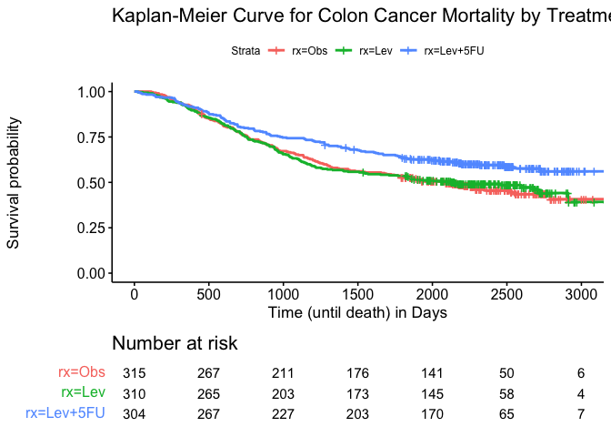
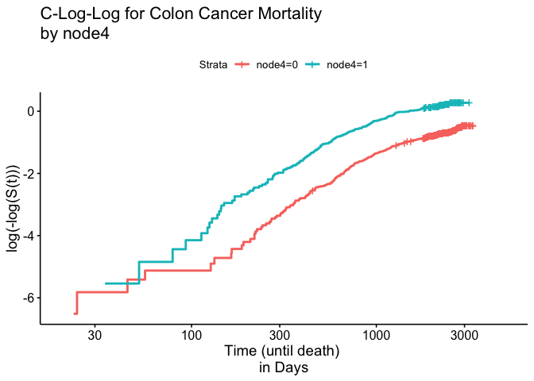
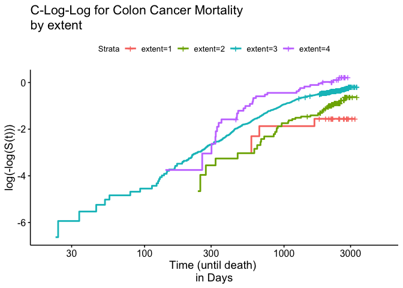
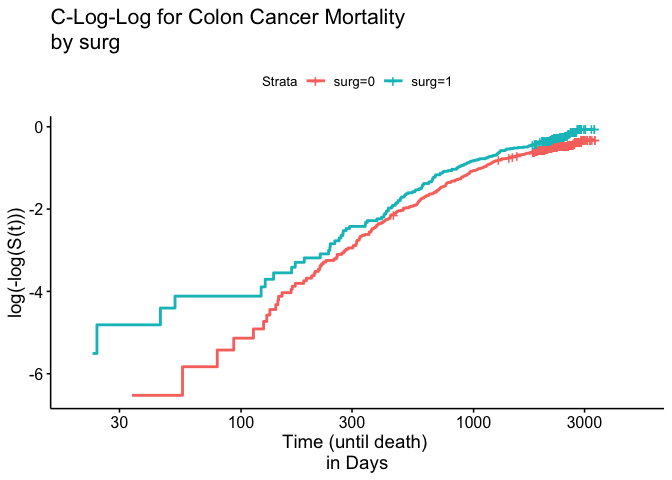
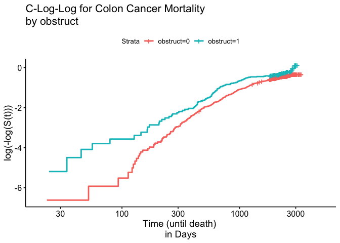
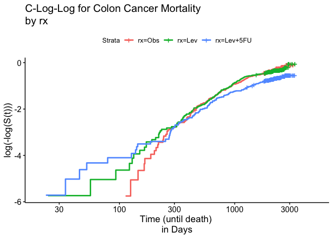

Survival Analysis of Mortality of Adjuvant Chemotherapy for Colon Cancer
================
Yijia Jiang, Ziyan Xu
2022-11-27

# Survival analysis for the event of mortality

``` r
library("survival")
library("ggplot2")
library("survminer")
```

    ## Loading required package: ggpubr

    ## 
    ## Attaching package: 'survminer'

    ## The following object is masked from 'package:survival':
    ## 
    ##     myeloma

### Model building process

#### Examining the data

Recall that there are two records for each patient indicated by the
event type (etype) variable, where etype == 1 refers to the event of a
recurrence and etype == 2 indicates death. In order to answer our first
research question, which is to study the time until death, we must
create a marginal model by subsetting the colon data to only include the
event of mortality. To get an overview of the mortality subset we use
the survfit function and plot the Kaplan-Meier Estimate between the
three different treatments.

``` r
#subset death data
colon.death <- subset(colon, etype == 2)

death.fit <- survfit(Surv(time,status) ~ rx, data = colon.death)

ggsurvplot(death.fit, conf.int = F, break.time.by = 500, 
           font.x.size = 13, font.y.size = 13, font.legend.size = 9,  
           title = "Kaplan-Meier Curve for Colon Cancer Mortality by Treatment", 
           xlab = "Time (until death) in Days",
           risk.table = T, risk.table.height = 0.25, risk.table.fontsize = 4, 
           tables.theme = theme_cleantable())
```

<!-- -->

Based on Figure 1, there is some indication that patients who received
the adjuvant treatment with levamisole plus fluorouracil (Lev+5Fu) have
a higher survival probability than patients with no further treatment
and patients who received the treatment with levamisole alone.

We do a proper Log-rank hypothesis test to test the null hypothesis of
no difference among the three treatments in the mortality model.

``` r
d.rx.coxph <- coxph(Surv(time, status) ~rx, data = colon.death) 
summary(d.rx.coxph)
```

    ## Call:
    ## coxph(formula = Surv(time, status) ~ rx, data = colon.death)
    ## 
    ##   n= 929, number of events= 452 
    ## 
    ##               coef exp(coef) se(coef)      z Pr(>|z|)   
    ## rxLev     -0.02664   0.97371  0.11030 -0.241  0.80917   
    ## rxLev+5FU -0.37171   0.68955  0.11875 -3.130  0.00175 **
    ## ---
    ## Signif. codes:  0 '***' 0.001 '**' 0.01 '*' 0.05 '.' 0.1 ' ' 1
    ## 
    ##           exp(coef) exp(-coef) lower .95 upper .95
    ## rxLev        0.9737      1.027    0.7844    1.2087
    ## rxLev+5FU    0.6896      1.450    0.5464    0.8703
    ## 
    ## Concordance= 0.536  (se = 0.013 )
    ## Likelihood ratio test= 12.15  on 2 df,   p=0.002
    ## Wald test            = 11.56  on 2 df,   p=0.003
    ## Score (logrank) test = 11.68  on 2 df,   p=0.003

From this log-rank test, we get a p-value that is closed to 0.002 which
is significant at a 0.05 level. We want to conclude that there is a
difference among the three treatments in the mortality model.

Moreover, variables nodes and node4 both indicate similar information
regarding the amount of positive lymph nodes an individual has. The
variable nodes measures the number of lymph nodes with detectable cancer
while node4 indicates whether there are more than 4 positive lymph nodes
(0 = No, 1 =Yes). Therefore, we decided to use only the variable node4
in our analysis.

Additionally, it is important to note that there are columns that
contain NA values. Out of 929 observations, 41 of them contain NA values
in at least one column. Since observations that contain NA values make
up only 4% of our data, we decided that removing them wouldn’t cause a
big effect on the variable selection process. By removing observations
with NA values, created a new mortality dataset colon.death1 which
contains 888 observations.

``` r
#removing NA values
colon.death1 <- na.omit(colon.death)
```

#### Variable selection

We now use forward selection with Akaike information criterion (AIC) to
determine the covariates that best represent an appropriate cox
proportional hazards model for the event of death. Within each step, we
chose the model that has the lowest AIC and BIC value.

``` r
d.model1 <- coxph(Surv(time, status) ~ sex, data = colon.death1) 
d.model2 <- coxph(Surv(time, status) ~ age, data = colon.death1) 
d.model3 <- coxph(Surv(time, status) ~ obstruct, data = colon.death1) 
d.model4 <- coxph(Surv(time, status) ~ perfor, data = colon.death1) 
d.model5 <- coxph(Surv(time, status) ~ adhere, data = colon.death1) 
d.model6 <- coxph(Surv(time, status) ~ node4, data = colon.death1) 
d.model7 <- coxph(Surv(time, status) ~ differ, data = colon.death1) 
d.model8 <- coxph(Surv(time, status) ~ extent, data = colon.death1)
d.model9 <- coxph(Surv(time, status) ~ surg, data = colon.death1)

AIC(d.model1, d.model2, d.model3, d.model4, d.model5, d.model6, d.model7, d.model8, d.model9)
```

    ##          df      AIC
    ## d.model1  1 5537.816
    ## d.model2  1 5537.345
    ## d.model3  1 5533.555
    ## d.model4  1 5537.461
    ## d.model5  1 5532.553
    ## d.model6  1 5454.138
    ## d.model7  1 5528.920
    ## d.model8  1 5510.924
    ## d.model9  1 5533.967

The model d.model6 has the smallest AIC value of 5510.924 in this step,
which contains covariate node4.

``` r
d.model6.1 <- coxph(Surv(time, status) ~ node4 + sex, data = colon.death1)
d.model6.2 <- coxph(Surv(time, status) ~ node4 + age, data = colon.death1)
d.model6.3 <- coxph(Surv(time, status) ~ node4 + obstruct, data = colon.death1)
d.model6.4 <- coxph(Surv(time, status) ~ node4 + perfor, data = colon.death1)
d.model6.5 <- coxph(Surv(time, status) ~ node4 + adhere, data = colon.death1)
d.model6.6 <- coxph(Surv(time, status) ~ node4 + surg, data = colon.death1)
d.model6.7 <- coxph(Surv(time, status) ~ node4 + differ, data = colon.death1)
d.model6.8 <- coxph(Surv(time, status) ~ node4 + extent, data = colon.death1)

AIC(d.model6.1, d.model6.2, d.model6.3, d.model6.4, d.model6.5, d.model6.6, d.model6.7, d.model6.8)
```

    ##            df      AIC
    ## d.model6.1  2 5456.110
    ## d.model6.2  2 5453.162
    ## d.model6.3  2 5450.437
    ## d.model6.4  2 5455.562
    ## d.model6.5  2 5451.289
    ## d.model6.6  2 5450.716
    ## d.model6.7  2 5452.301
    ## d.model6.8  2 5435.463

The model d.model6.8 has the smallest AIC value of 5435.463 in this
step, which contains covariate node4 and extent.

``` r
d.model6.8.1 <- coxph(Surv(time, status) ~ node4 + extent + sex, data = colon.death1)
d.model6.8.2 <- coxph(Surv(time, status) ~ node4 + extent + age, data = colon.death1)
d.model6.8.3 <- coxph(Surv(time, status) ~ node4 + extent + obstruct, data = colon.death1)
d.model6.8.4 <- coxph(Surv(time, status) ~ node4 + extent + perfor, data = colon.death1)
d.model6.8.5 <- coxph(Surv(time, status) ~ node4 + extent + adhere, data = colon.death1)
d.model6.8.6 <- coxph(Surv(time, status) ~ node4 + extent + differ, data = colon.death1)
d.model6.8.7 <- coxph(Surv(time, status) ~ node4 + extent + surg, data = colon.death1)

AIC(d.model6.8.1, d.model6.8.2, d.model6.8.3, d.model6.8.4, d.model6.8.5, d.model6.8.6, d.model6.8.7)
```

    ##              df      AIC
    ## d.model6.8.1  3 5437.397
    ## d.model6.8.2  3 5434.533
    ## d.model6.8.3  3 5433.444
    ## d.model6.8.4  3 5437.225
    ## d.model6.8.5  3 5434.423
    ## d.model6.8.6  3 5435.178
    ## d.model6.8.7  3 5431.745

The model d.model6.8.7 has the smallest AIC value of 5431.745 in this
step, which contains covariate node4, extent and surg.

``` r
d.model6.8.7.1 <- coxph(Surv(time, status) ~ node4 + extent + surg + sex, data = colon.death1)
d.model6.8.7.2 <- coxph(Surv(time, status) ~ node4 + extent + surg + age, data = colon.death1)
d.model6.8.7.3 <- coxph(Surv(time, status) ~ node4 + extent + surg + obstruct, data = colon.death1)
d.model6.8.7.4 <- coxph(Surv(time, status) ~ node4 + extent + surg + perfor, data = colon.death1)
d.model6.8.7.5 <- coxph(Surv(time, status) ~ node4 + extent + surg + adhere, data = colon.death1)
d.model6.8.7.6 <- coxph(Surv(time, status) ~ node4 + extent + surg + differ, data = colon.death1)

AIC(d.model6.8.7.1, d.model6.8.7.2, d.model6.8.7.3, d.model6.8.7.4, d.model6.8.7.5, d.model6.8.7.6)
```

    ##                df      AIC
    ## d.model6.8.7.1  4 5433.705
    ## d.model6.8.7.2  4 5430.982
    ## d.model6.8.7.3  4 5429.847
    ## d.model6.8.7.4  4 5433.546
    ## d.model6.8.7.5  4 5430.930
    ## d.model6.8.7.6  4 5431.458

The model d.model6.8.7.3 has the smallest AIC value of 5429.847 in this
step, which contains covariate node4, extent, surg and obstruct.

``` r
d.model6.8.7.3.1 <- coxph(Surv(time, status) ~ node4 + extent + surg + obstruct + sex, data = colon.death1)
d.model6.8.7.3.2 <- coxph(Surv(time, status) ~ node4 + extent + surg + obstruct + age, data = colon.death1)
d.model6.8.7.3.3 <- coxph(Surv(time, status) ~ node4 + extent + surg + obstruct + perfor, data = colon.death1)
d.model6.8.7.3.4 <- coxph(Surv(time, status) ~ node4 + extent + surg + obstruct + adhere, data = colon.death1)
d.model6.8.7.3.5 <- coxph(Surv(time, status) ~ node4 + extent + surg + obstruct + differ, data = colon.death1)

AIC(d.model6.8.7.3.1, d.model6.8.7.3.2, d.model6.8.7.3.3, d.model6.8.7.3.4, d.model6.8.7.3.5)
```

    ##                  df      AIC
    ## d.model6.8.7.3.1  5 5431.741
    ## d.model6.8.7.3.2  5 5428.206
    ## d.model6.8.7.3.3  5 5431.791
    ## d.model6.8.7.3.4  5 5428.898
    ## d.model6.8.7.3.5  5 5429.273

The model d.model6.8.7.3.2 has the smallest AIC value of 5428.206 in
this step, which contains covariate node4, extent, surg, obstruct and
age.

``` r
d.model6.8.7.3.2.1 <- coxph(Surv(time, status) ~ node4 + extent + surg + obstruct + age + sex, data = colon.death1)
d.model6.8.7.3.2.2 <- coxph(Surv(time, status) ~ node4 + extent + surg + obstruct + age + perfor, data = colon.death1)
d.model6.8.7.3.2.3 <- coxph(Surv(time, status) ~ node4 + extent + surg + obstruct + age + adhere, data = colon.death1)
d.model6.8.7.3.2.4 <- coxph(Surv(time, status) ~ node4 + extent + surg + obstruct + age + differ, data = colon.death1)

AIC(d.model6.8.7.3.2.1, d.model6.8.7.3.2.2, d.model6.8.7.3.2.3, d.model6.8.7.3.2.4)
```

    ##                    df      AIC
    ## d.model6.8.7.3.2.1  6 5430.058
    ## d.model6.8.7.3.2.2  6 5430.109
    ## d.model6.8.7.3.2.3  6 5427.832
    ## d.model6.8.7.3.2.4  6 5427.867

The model d.model6.8.7.3.2.3 has the smallest AIC value of 5427.832 in
this step, which contains covariate node4, extent, surg, obstruct, age
and adhere.

``` r
d.model6.8.7.3.2.3.1 <- coxph(Surv(time, status) ~ node4 + extent + surg + obstruct + age + adhere + sex, data = colon.death1)
d.model6.8.7.3.2.3.2 <- coxph(Surv(time, status) ~ node4 + extent + surg + obstruct + age + adhere + perfor, data = colon.death1)
d.model6.8.7.3.2.3.3 <- coxph(Surv(time, status) ~ node4 + extent + surg + obstruct + age + adhere + differ, data = colon.death1)

AIC(d.model6.8.7.3.2.3.1, d.model6.8.7.3.2.3.2, d.model6.8.7.3.2.3.3)
```

    ##                      df      AIC
    ## d.model6.8.7.3.2.3.1  7 5429.671
    ## d.model6.8.7.3.2.3.2  7 5429.827
    ## d.model6.8.7.3.2.3.3  7 5427.963

In this step, AIC values for all the models are not smaller than AIC
values for all the models in the previous step. Hence, we stopped
fitting the model with more covariates.

``` r
d.model.full <- coxph(Surv(time, status) ~ sex + age + obstruct + perfor + adhere + differ + extent + surg + node4, data = colon.death1)
AIC(d.model.full, d.model6.8.7.3.2.3.2, d.model6.8.7.3.2.3, d.model6.8.7.3.2, d.model6.8.7.3, d.model6.8.7, d.model6.8, d.model6)
```

    ##                      df      AIC
    ## d.model.full          9 5431.855
    ## d.model6.8.7.3.2.3.2  7 5429.827
    ## d.model6.8.7.3.2.3    6 5427.832
    ## d.model6.8.7.3.2      5 5428.206
    ## d.model6.8.7.3        4 5429.847
    ## d.model6.8.7          3 5431.745
    ## d.model6.8            2 5435.463
    ## d.model6              1 5454.138

We fit a model with all the covariates in the dataset to obtain its AIC
value. Then we compare its AIC value to the smallest AIC value of each
previous step to obtain the best model with less covariates.

The resulting model with the lowest AIC is: Surv(time, status) \~
node4 + extent + surg + obstruct + age + adhere

Next, we used the Analysis of Deviance procedure to get the proper
Likelihood Ratio Test to confirm if each of the covariates selected by
the forward selection method is significant to include in the Cox
Proportional Model.

``` r
anova(d.model6.8.7.3.2.3)
```

    ## Analysis of Deviance Table
    ##  Cox model: response is Surv(time, status)
    ## Terms added sequentially (first to last)
    ## 
    ##           loglik   Chisq Df Pr(>|Chi|)    
    ## NULL     -2767.9                          
    ## node4    -2726.1 83.6852  1  < 2.2e-16 ***
    ## extent   -2715.7 20.6747  1  5.443e-06 ***
    ## surg     -2712.9  5.7179  1    0.01679 *  
    ## obstruct -2710.9  3.8984  1    0.04833 *  
    ## age      -2709.1  3.6410  1    0.05637 .  
    ## adhere   -2707.9  2.3738  1    0.12339    
    ## ---
    ## Signif. codes:  0 '***' 0.001 '**' 0.01 '*' 0.05 '.' 0.1 ' ' 1

We can see that p-value for covariate node4, extent, surg and obstruct
is smaller than 0.05 which means they have a significant effect on time
until death. Therefore, we will include these four covariates in our Cox
PH model.

#### Model evaluation

##### C-log-log plot

To check the proportional hazards assumption for this model, we use a
diagnostic plot such as the c-log-log plot. Before we plot the C-log-log
plot, we need to account for the observations we previously omitted from
the data. Hence, we created a second death dataset colon.death2 and
replaced the NA values in covariate nodes with its mean and conditioned
the NA values in covariate differ into an additional factor level. Then
we checked the significance of each covariate again using Analysis of
Deviance procedure to ensure that our previous model is still valid.

``` r
 colon.death2 <- colon.death
 colon.death2$nodes[is.na(colon.death2$nodes)] <- mean(colon.death2$nodes, na.rm = TRUE)
 colon.death2$differ <- factor(colon.death2$differ, exclude=NULL)
```

``` r
dnode4.fit <- survfit(Surv(time, status) ~node4, data = colon.death2)
ggsurvplot(dnode4.fit, conf.int = F,
    fun = "cloglog",
    xlim = c(20, 5000),
    title = "C-Log-Log for Colon Cancer Mortality \nby node4", 
    xlab = "Time (until death) \nin Days")
```

<!-- -->

In figure 2, the two curves in this C-log-log plot cross over at the
beginning of the study but appear to be parallel to each other after 100
days. Since the data is oftentimes noisy at the beginning of the study,
the cross over does not cause too much concern. Overall, we believe that
the cox proportional assumption is appropriate for the covariate node4
since the curves are consistently parallel throughout most of the study.

We continue to plot the C-log-log plot for the covariate extent.

``` r
dextent.fit <- survfit(Surv(time, status) ~extent, data = colon.death2)
ggsurvplot(dextent.fit, conf.int = F,
    fun = "cloglog",
    xlim = c(20, 5000),
    title = "C-Log-Log for Colon Cancer Mortality \nby extent", 
    xlab = "Time (until death) \nin Days")
```

<!-- -->

In figure 3, the curves in the C-log-log plot are crossing over after
100 days. Since there are not enough data points in each extent group to
show a more comprehensive trend, it’s hard for us to make a decision
based on the plot.

We continue to plot the C-log-log plot for the covariate surg.

``` r
dsurg.fit <- survfit(Surv(time, status) ~ surg, data = colon.death2)
ggsurvplot(dsurg.fit, conf.int =F,
    fun = "cloglog",
    xlim = c(20, 5000),
    title = "C-Log-Log for Colon Cancer Mortality \nby surg", 
    xlab = "Time (until death) \nin Days")
```

<!-- -->

In figure 4, the curves in the C-log-log plot are consistently parallel
throughout most of the study, so we believe that the cox proportional
assumption is appropriate for the covariate surg.

We continue to plot the C-log-log plot for the covariate obstruct.

``` r
dobstruct.fit <- survfit(Surv(time, status) ~ obstruct, data = colon.death2)
ggsurvplot(dobstruct.fit, conf.int = F,
    fun = "cloglog",
    xlim = c(20, 5000),
    title = "C-Log-Log for Colon Cancer Mortality \nby obstruct", 
    xlab = "Time (until death) \nin Days")
```

<!-- -->

In figure 5, the curves in the C-log-log plot are consistently parallel
throughout most of the study, so we believe that the cox proportional
assumption is appropriate for the covariate obstruct.

Lastly, we plotted the C-log-log for the covariate rx.

``` r
drx.fit <- survfit(Surv(time, status) ~ rx, data = colon.death2)
ggsurvplot(drx.fit, conf.int = F,
    fun = "cloglog",
    xlim = c(20, 5000),
    title = "C-Log-Log for Colon Cancer Mortality \nby rx", 
    xlab = "Time (until death) \nin Days")
```

<!-- -->

In Figure 6, the distance between three treatment curves begin to narrow
after 300 days which causes some concern that the assumption might be
violated. However, it is also reasonable to assume that the curves are
wider apparent earlier in the study since there are less occurrences of
death before 300 days. Hence we believe it is best to ignore the
noisiness of the plot since the curves are roughly parallel after 300
days. Thus, the cox proportional hazards assumption is valid to use for
this covariate.

#### Goodness of fit test

We used the cox.zph function to further justify our conclusion.

``` r
cox.zph(coxph(formula =Surv(time, status) ~ node4 + extent + surg + obstruct + rx, data = colon.death2))
```

    ##          chisq df      p
    ## node4     6.32  1 0.0119
    ## extent    3.79  1 0.0516
    ## surg      0.02  1 0.8875
    ## obstruct  6.40  1 0.0114
    ## rx        1.92  2 0.3827
    ## GLOBAL   18.18  6 0.0058

Since the p value for node4 is less than 0.05, there is significant
evidence that the cox proportional model assumption is violated for
variable node4. However, we observed in Figure 2 that the C-log-log
curves for covariate node4 appear parallel. We believe that the
significance of p-value might be due to some noise in the data at the
beginning of the study. All in all, we conclude that the cox
proportional hazards assumption has been met and is reasonable to use
for this model.
